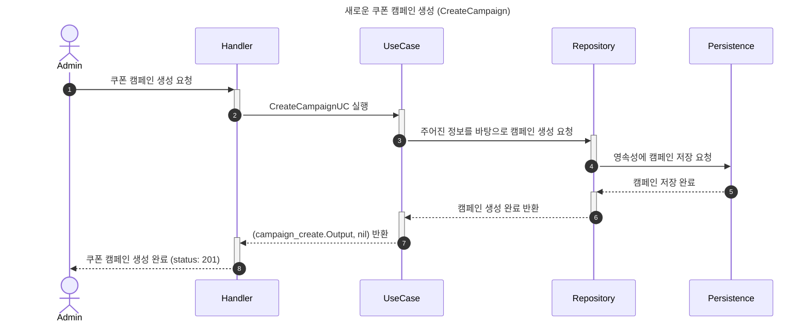
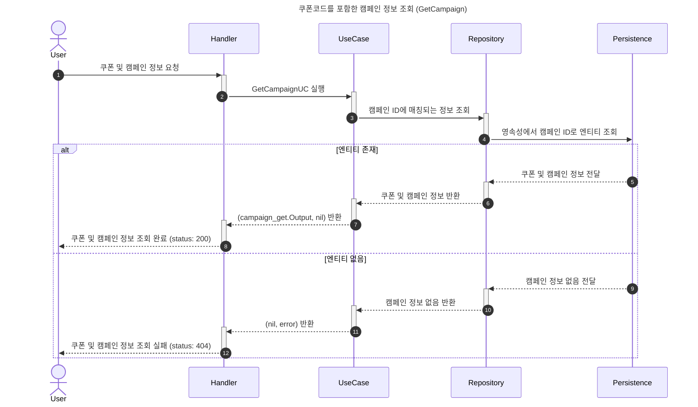
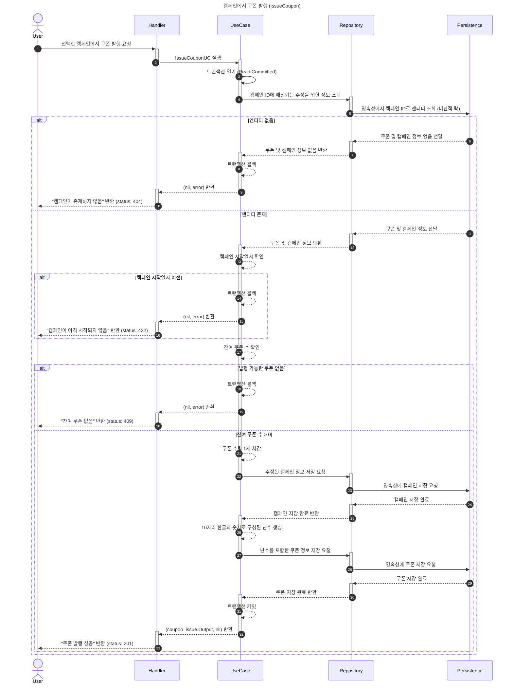

# 쿠폰 발행 시스템

## 1. 개요
* [과제 내용](./doc/PROBLEM.md)

## 2. 기술 선택
- **connectrpc**: 과제 기본 요구사항

### 2.1 고려 사항

## 3. 아키텍처
클린 아키텍처 + DDD를 적용하고 있지만 의미없는 계층 구분에 추가적인 비용을 사용하지 않고 어디에서나 통용될 수 있는 아키텍처를 구성하는 것에 집중했습니다.
- 서로 분리된 레이어는 리포지토리를 통해 정보를 교환한다.
- 데이터 영속성 계층을 분리하는 경우 외에는 불필요한 인터페이스 추상화를 지양한다.
- 비즈니스 요구사항은 하나의 독립적인 기능이어야 한다. 비즈니스 로직의 변경이 의도치 않은 다른 유스케이스의 변동으로 전파되지 않도록 주의한다.
- DTO를 작성하는 것도 비용이기 때문에 유스케이스 구조체 내부에 Input/Output 구조체를 정의하고, Execute 메소드는 단일 Input을 매개변수로 받고 단일 Output을 반환한다.

### 3.1. 파일트리
기본적으로 클린 아키텍처를 기반으로 작성했으며, DDD에서 권장하는 컨벤션에 따라 아래와 같은 레이어를 가집니다.

- **domain**: 비즈니스 규칙과 데이터 모델과 연관된 엔티티, 값 객체, 열거형, 리포지토리, 도메인 서비스 등이 여기에 위치합니다.
- **application**: 비즈니스 로직을 담당하는 유스케이스가 여기에 위치합니다.
- **infra**: 서드파티 등 서비스와 느슨한 연결점을 가진 인프라스트럭처가 여기에 위치합니다.
- **interfaces**: 외부와 상호작용하는 엔드포인트가 여기에 위치합니다.

### 3.2. 시퀀스 다이어그램

### 3.3. ERD

## 4. 핵심 문제 해결 전략

### 4.1. 문제 해석
시작 부터 의문점이 생겼다. "쿠폰 발행은 지정된 일시에 자동으로 시작되어야 한다"는 문구는 단순 엔드포인트를 작성하는 것을 넘어 마치 프로덕션에 E2E 테스트케이스가 포함되어 있는 구조를 떠올리게 했다. 출고되자마자 갑자기 365일 24시간 공회전을 하기 시작하는 자동차를 상상해 봤다. 단지 백그라운드 작업을 구성할 수 있는 능력을 시험하는 것이 출제 의도였을까?

우선 캠페인 생성이라는 엔드포인트가 요구사항이라는 점에 주목해 보기로 했다. 캠페인 생성 시에 시작일시를 정하고 생성할 텐데, 이 시작일시를 기준으로 스케줄러를 시작하면 될 것 같다. 따라서 cmd 레이어에는 컴파일을 위한 main.go 파일이 두 개가 되어야 한다.

### 4.2. 동시성 제어

### 4.3. 기타 해결 전략

## 5. 실행 및 테스트 방법

### 5.1. 시스템 실행

### 5.2. 부하 테스트 실행

## 6. 테스트 결과 및 결론

## 7. 향후 개선 과제
