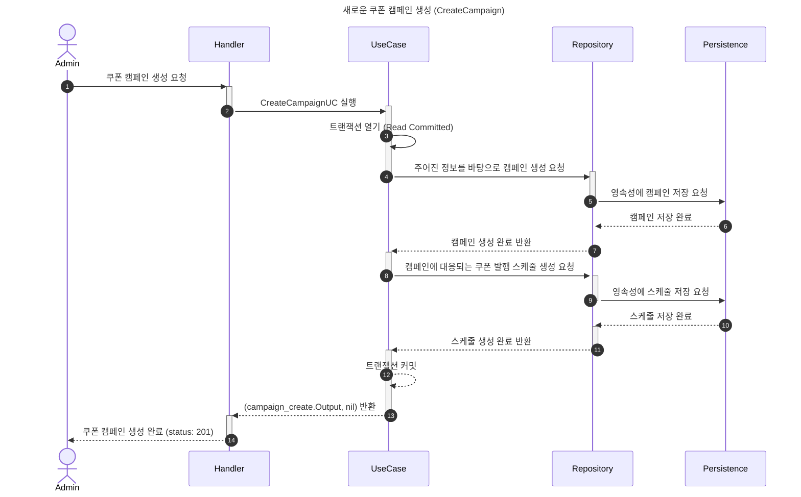
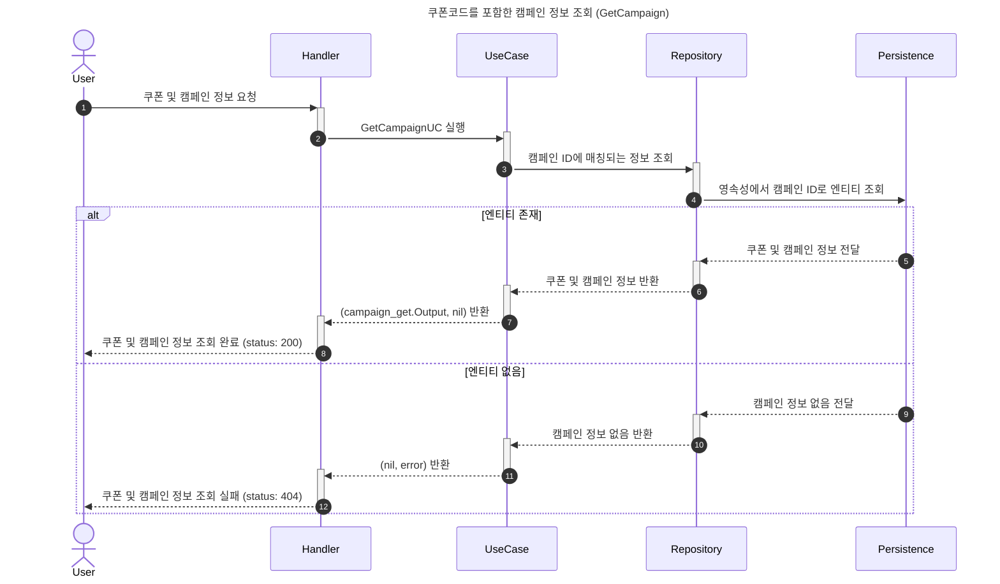
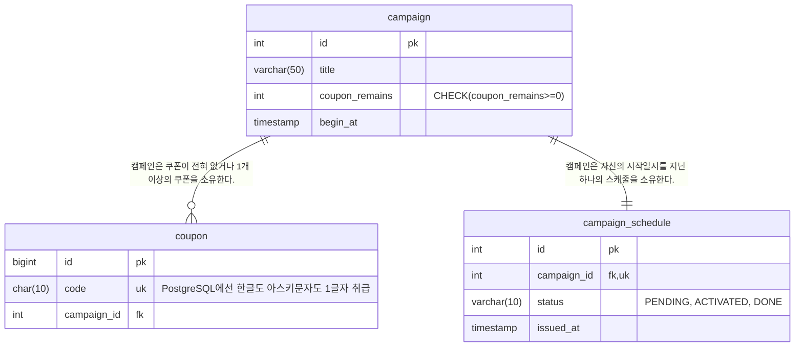

# 쿠폰 발행 시스템
- [과제 내용 전문](./doc/PROBLEM.md)

## 1. 핵심 비즈니스 요구사항 이해하기

### 1.1. 이 과제는 어떤 시스템인가?
시작 부터 의문점이 생겼다. "쿠폰 발행은 지정된 일시에 자동으로 시작되어야 한다"는 문구는 단순 엔드포인트를 작성하는 것을 넘어 마치 프로덕션에 E2E 테스트케이스가 포함되어 있는 구조를 떠올리게 했다. 출고되자마자 갑자기 365일 24시간 공회전을 하기 시작하는 자동차를 상상해 봤다. 단지 엔드포인트 작성에 더해서 높은 부하를 일으키는 백그라운드 작업을 구성할 수 있는 능력을 시험하는 것이 출제 의도였을까? 우선 캠페인 생성이라는 엔드포인트가 요구사항이라는 점에 주목해 보기로 했다. 캠페인 생성 시에 시작일시를 정하고 생성할 텐데, 이 시작일시를 기준으로 스케줄러를 시작하면 될 것 같다. 따라서 `cmd` 레이어에는 컴파일을 위한 `main.go` 파일이 두 개가 되어야 한다. 마침 "예상 트래픽이 초당 500-1000개의 요청"이라는 전제가 포함되어 있으니 실제로 스케줄러를 준비한 뒤 초당 500-1000개의 `connectrpc` 요청이 시작되도록 구성하면 될 것 같다.

### 1.2. 데이터 저장은 어디에, 어떻게 하는가?
두번째로, 스케일 아웃에 의한 분산이 고려되어 있는 상황에서 쿠폰이 저장될 영속성이 필요하다는 것이다. 이를 보자마자 RDBMS를 사용하기로 했지만 분명 출제 내용에는 DB와 관련된 내용이 없다. 포지션에서는 `PostgreSQL`과 `NoSQL`을 활용한다고 했었는데, 그럼 `NoSQL`을 써야할까? 이 부분에 대해 고민해 봤지만 우선 기능이 단순하기 때문에 `NoSQL`은 현재 수준에서는 불필요한 기술이 될 가능성이 높다. 오히려 데이터 정합성을 해칠 가능성이 있기 때문에 배제. 따라서 RDBMS에 해당하는 가장 작은 단위인 `SQLite`를 쓰거나 기술스택에 존재하는 `PostgreSQL`를 사용하는 게 출제의도와 결이 맞을 텐데, 문제는 `SQLite`는 파일 단위로 관리되는 특성 때문에 `스케일 아웃`이 이뤄지는 환경에서 사용하기가 곤란한 데다가 동시성 제어에 필요한 락 기능도 빠져 있다. 결과적으로 `PostgreSQL`만 사용하는 것으로 결정했다.

그럼 ORM은 어떻게, 어떤 걸 사용할까? 우선 `Go`에서 ORM을 사용하는 방식을 확인해 보니 어떤 ORM이든 DB에 연결하기 위한 드라이버가 필요하다. 이는 마치 Python에서 sqlalchemy라는 ORM과 psycopg2 드라이버를 함께 사용하는 구성와 결이 같았다. 하지만 본인은 주 언어스택이 `Go`가 아니고 `Go`의 문법 정도만 접한 상태인 데다가 제한시간은 사흘 뿐. 따라서 러닝커브를 강력하게 고려해야 한다. 가장 많이 쓰는 편이라고 알려진 `gorm`은 러닝커브를 문제로 여기서 제외, `Go`의 표준 인터페이스인 `database/sql` 패키지가 평문 쿼리를 사용 가능하다는 점에서 먼저 고려됐고, 선택한 RDBMS가 `PostgreSQL`이라는 점에서 `pgx`를 살펴봤는데 상당히 괜찮아서 `pgx`를 사용하기로 했다. 왜냐하면 `database/sql`만 사용하는게 불편하다는 이유로 `sqlx`라는 패키지가 개발됐다는 내러티브로 이해되는데, `pgx`는 `sqlx`에서 제공하는 수준의 확장을 지원하는 데다가 `PostgreSQL` 전용 드라이버도 포함돼있다고 한다. 이 시스템 한정으로는 위에서 이미 결정된 `PostgreSQL`이 다른 RDBMS로 변경될 가능성은 0에 수렴하니 `pgx`로 결정.

### 1.3. 동시성 제어는 어떻게 해야할까?
동시성 제어는 문제의 개요에도 적혀있는 핵심 비즈니스 요구사항에 해당한다. 주로 클라이언트에서 동시에 접근할 때에 데이터의 무결성이 주요 문제점이 될 것이고, 이걸 해결하기 위해서는 `낙관적 락`, `비관적 락`, `분산 락`이 고려되며, 아예 `메시지브로커`의 큐로 넘겨서 락을 걸지 않고 해결하는 방법도 있다는 것을 지식으로 알고 있다. 하지만 우선 `낙관적 락`의 경우에는 쿠폰의 발행이라는 행위 자체가 데이터 수정이 빈번하게 일어나는 케이스이기 때문에 고려에서 배제했고, `메시지브로커`의 경우에도 무결성 보장에 더해 순서를 보장한다는 이점은 추가되겠지만 애초에 순서 보장은 이 과제에서 말하는 비즈니스 요구사항이 아니고, 작업이 완료된 이후에 클라이언트에게 쿠폰이 발행되었는지 여부를 알려야 하는 문제가 있는 등 오버엔지니어링이 될 가능성이 높다. 그러면 `비관적 락`과 `분산 락`만 남는데, `분산 락`을 사용하게 된다면 `Redis`나 `Valkey` 사용이 강제되고 이러한 인프라스트럭처를 추가하기엔 이 시스템은 `분산 락` 외에 용도가 없다고 봐도 무방하다. 게다가 프로그램이 강제종료 됐을 때 `분산 락`이 데드락이 되는 부분도 해결할 필요가 있다. 초당 500-1000회의 요청, 특히 과제 특성상 인트라넷에서 작동할 텐데 이러한 트레이드 오프를 감당할 정도는 아니라고 판단했고, 다른 인프라스트럭처를 추가할 필요 없이 `PostgreSQL`은 이미 `비관적 락`을 포함하고 있기 때문에 `비관적 락`을 활용해서 동시성 제어 문제를 해결하기로 했다.

## 2. 기술 선택
- **connectrpc**: 과제 기본 요구사항입니다.
- PostgreSQL: 캠페인/쿠폰 정보를 담는 영속성이자 분산환경에서 동시성처리의 핵심 기능을 담당합니다.
- pgx: PostgreSQL 드라이버 확장입니다.
- Docker: 인프라스트럭처와 서비스 컨테이너를 포함하며, 스케일 아웃의 핵심 기능을 담당합니다.
- Nginx: 스케일 아웃 된 Go 서비스를 로드밸런싱 하는 역할을 담당합니다.

### 2.1. `connectrpc`란 무엇인가?
처음 사용하는 입장에서는 생소한 개념이 하나 남아있다. 그게 바로 이 과제에서 비즈니스 요구사항 해결에 반드시 사용해야 할 것으로 과제에서 지정한 `connectrpc`다. 우선 `connectrpc`가 등장하게 된 배경에 대해 살펴보니 거기엔 `gRPC`가 있었다. `gRPC`는 구글이 만든 것으로 알려진 `Protobuf` 사용을 강제하는 고성능 RPC 프레임워크라고 한다. 이 `Protobuf` 또한 구글에서 만든 `JSON`과는 다른 `gRPC`의 직렬화 방식이었는데, 바이너리 형태로 직렬화 후 데이터를 교환하기 때문에 작은 대역폭으로도 충분히 빠르고 간결한 통신을 도와준다고 한다. 하지만 `gRPC`는 사용법이 너무 복잡하고, 여전히 `HTTP/1.1`을 사용하는 환경이 많았던 그 당시의 상황에서 `gRPC`는 `HTTP/2`의 특정 기능들을 요구했기 때문에 범용으로 쓰기 어려운 치명적인 문제가 있었고, 이에 따라 `gRPC-Web`과 같은 프록시 서버를 통해 비로소 브라우저 지원은 추가됐지만 이 부분에서 더 나은 방향으로 문제점을 해결하기 위해 `connectrpc`가 등장했다는 거다.

그럼 `connectrpc`는 무엇을 어떻게 해서 `gRPC`의 단점을 극복했을까? 일단 `connectrpc`는 `gRPC`의 장점을 계승한 `REST` 서비스를 구성하겠다는 철학이 있었다. `connectrpc`는 이 핵심 철학을 지키기 위해 내부적으로 `gRPC` 및 `gRPC-Web`프로토콜을 함께 지원해서 기존에 `gRPC`를 사용하던 서비스와의 호환성을 지키고, `REST` 서비스로서의 기능을 하기 위해 `Connect` 프로토콜이라는 것을 추가했다는 것이다. 이 `Connect` 프로토콜은 `gRPC`와의 호환성을 고려하면서 `Protobuf`를 강제하는 구성까지도 `gRPC`와 구성을 맞췄다. 이런 구성을 취한 이유에 대해서는 찾기 어려웠지만 아마도 컴파일 시점에 통신 명세를 보장한다는 부분이 자유도를 포기하고도 여전히 이점이라는 판단이었다고 생각한다. 그 이유는 이 프로토콜 명세를 강제하는 부분이 `MSA`아키텍처에서 다양한 인프라스트럭처간의 정보 교환에서 일관성을 유지할 수 있다는 관점에서 강점이 될 수 있을 것 같았기 때문이다.

## 3. 아키텍처
`클린 아키텍처` + `DDD`를 적용하고 있지만 의미없는 계층 구분에 추가적인 비용을 사용하지 않고 어디에서나 통용될 수 있는 아키텍처를 구성하는 것에 집중했습니다.
- 서로 분리된 레이어는 리포지토리를 통해 정보를 교환한다.
- 데이터 영속성 계층을 분리하는 경우 외에는 불필요한 인터페이스 추상화를 지양한다.
- 비즈니스 요구사항은 하나의 독립적인 기능이어야 한다. 비즈니스 로직의 변경이 의도치 않은 다른 유스케이스의 변동으로 전파되지 않도록 주의한다.
- `DTO`를 작성하는 것도 비용이기 때문에 유스케이스 구조체 내부에 `Input`/`Output` 구조체를 정의하고, `Execute` 메소드는 단일 `Input`을 매개변수로 받고 단일 `Output`을 반환한다.

### 3.1. 파일트리
기본적으로 클린 아키텍처를 기반으로 작성했으며, `DDD`에서 권장하는 컨벤션에 따라 아래와 같은 레이어를 가집니다.

- **domain**: 비즈니스 규칙과 데이터 모델과 연관된 엔티티, 값 객체, 열거형, 리포지토리, 도메인 서비스 등이 여기에 위치합니다.
- **application (app)**: 비즈니스 로직을 담당하는 유스케이스가 여기에 위치합니다.
- **infrastructure (infra)**: 서드파티 등 서비스와 느슨한 연결점을 가진 인프라스트럭처가 여기에 위치합니다.
- **interfaces (api)**: 외부와 상호작용하는 엔드포인트가 여기에 위치합니다.

### 3.2. 시퀀스 다이어그램





### 3.3. ERD


## 4. 진행 경과
- 개발 방향은 탑다운(엔드포인트 종단점 부터 영속성 구체화 까지)으로 진행됩니다.
- Git branch 구성은 기능 단위 `work` 브랜치 밑에 `feat` 브랜치로 세부 구현을 둡니다.

### 4.1. `connectrpc` 명세 정의하기
`connectrpc`를 사용하기에 앞서, 자료를 찾으면서 `.proto` 파일을 통해 프로토콜 명세를 생성해야 한다는 사실을 이미 알고 있다. 하지만 이걸 어떻게 생성하고 사용하는지 문법이나 작성 방식에 대해서는 다소 생소한데, 이 부분에 대한 명세 정의를 시작하려고 한다.

#### 4.1.1. `.proto` 파일 정의하기
먼저 `.proto` 파일의 문법에 따라 각 파일들을 정의하기 위해 파일을 생성했다. 작성 과정에서 campaign의 begin_at과 같은 날짜 포맷은 어떻게 관리하는지 궁금했고, 다음과 같은 선택지들이 있었다.

1. google.protobuf.Timestamp
2. iso-8601 포맷 string
3. unix timestamp를 담는 int64

여기서는 1번 선택지가 코드 수준에서도 VO로 관리할 수 있을 것 같기도 했고, 간단하게 `.proto`파일 상단에 `import "google/protobuf/timestamp.proto";` 한 줄만 추가하면 쓸 수 있다고 하니 가볍게 사용해 보기로 했다.

작성이 완료됐고, 각 파일의 위치를 유스케이스와 맞춰 구성된 파일트리는 아래와 같다.
```
proto
├── campaign
│   ├── create.proto
│   └── get.proto
└── coupon
    └── issue.proto
```

#### 4.1.2. `.proto` 파일 컴파일하기
실제 프로젝트에서 사용할 수 있는 소스코드를 생성하려면 위 단락에서 생성한 `.proto` 파일을 기반으로 컴파일을 해야한다. 찾아 보니 `protoc`와 `buf`라는 컴파일러가 있었고, `protoc`는 컴파일 기능에 집중된 반면 `buf`는 `protoc`를 기반으로 프로토콜 종속성 관리까지 도와주는 진보된 도구였다. 그래서 `buf`를 사용하기로 했는데, `buf`는 추가로 설정 파일을 프로젝트에 포함할 필요가 있다고 한다. 이 파일을 생성하려면 먼저 `buf`를 설치하고, `buf config init`을 실행하면 `buf` 환경이 초기화된다. 자, 그럼 `buf generate`를 실행해 보자.

> Failure: read buf.gen.yaml: file does not exist

아무래도 설정 파일로 `buf.gen.yaml` 파일을 추가해야 하는 모양이다. 어디에도 이걸 자동으로 생성해주는 명령어를 찾을 수 없어서 검색을 해보니 이 파일은 생성 규칙이나 플러그인을 설정하는 파일이라 규칙도 사용하는 플러그인도 정해진 답이 없는 이상은 수기로 작성해야 하는 게 납득이 갔다. 자료를 찾아 기능이 어울리는 플러그인과 컴파일된 소스파일이 출력되는 폴더를 지정하려면 `out` 속성에 경로를 지정해야 한다는 내용을 보며 파일을 직접 생성했고, 분명 위에서 생성된 `buf.yaml`은 (version: v2)인데 검색으로 나온 `buf.gen.yaml`에 대한 예제는 v1으로 구성되어 있었고, 나는 이 두 파일의 버전을 v2로 맞추고 싶어서 [Buf 공식 문서](https://buf.build/docs/configuration/v2/buf-gen-yaml/)를 참조해서 작성해봤다.

v2로만 변경하면 `buf generate` 명령어 사용 시 plugins.plugin 속성에서 아래와 같은 오류가 나는데

>Failure: decode buf.gen.yaml: invalid as version v2: could not unmarshal as YAML: yaml: unmarshal errors: \
&nbsp; line 3: field plugin not found in type bufconfig.externalGeneratePluginConfigV2 \
&nbsp; line 7: field plugin not found in type bufconfig.externalGeneratePluginConfigV2

공식 문서에 따르면 plugins.plugin 속성은 v2 버전에서 더 이상 사용되지 않고 plugins.remote로 변경해 주면 끝이다. 그럼 이제 진짜로 `buf generate` 출력 결과를 기대해 보기로 했다.

```
internal/api/proto
├── campaign
│   ├── campaignconnect
│   │   ├── create.connect.go
│   │   └── get.connect.go
│   ├── create.pb.go
│   └── get.pb.go
└── coupon
    ├── couponconnect
    │   └── issue.connect.go
    └── issue.pb.go
```

이렇게 성공적으로 `.proto` 명세에 대응하는 파일들이 생성됐다.

### 4.2. 엔드포인트 구현하기
`connectrpc`를 사용하기 위한 사전 명세와 컴파일된 명세 파일들 까지 준비됐으니 이제 엔드포인트를 구현할 차례다. 아무래도 일반적인 `REST API` 엔드포인트와는 같은 프로토콜을 쓸 수 있게 지원한다 하더라도 구현 자체는 결이 다를 것으로 예상된다.

#### 4.2.1. `connectrpc` proto 정의 handler에 매핑하기
`buf`가 편하게 명세와 Request/Response에 해당하는 DTO까지 구성해 줬으니 DTO를 구성하기 위해 만든 `rpc/{domain}/schemas.go` 파일은 모두 삭제하고, 명세에 맞게 작성만 하면 되는데 사소한 문제가 생겼다. proto 파일은 서비스 핸들러를 자동으로 생성해 주는데, 이 서비스 핸들러 정의를 `.proto` 파일 단위로 작성하니 서비스 핸들러가 도메인 단위가 아니라 종단점 단위로 분리되어버린 거다. 따라서 서비스 핸들러를 하나로 합칠 방법이 필요했는데, `.proto` 파일은 작성된 내용을 다른 `.proto` 파일로 import가 가능했다. 이 방법을 이용해서 서비스에 관련된 `.proto` 파일을 별도의 파일로 분리했다.

```
proto
├── campaign
│   ├── create.proto
│   ├── get.proto
│   └── service.proto
└── coupon
    ├── issue.proto
    └── service.proto
```
coupon 도메인의 issue.proto는 그대로 사용해도 문제는 없지만 맥락상 `.proto`파일 관리의 일관성 차원에서 분리했다. 이후 rpc/main.go 에서 이 핸들러 패키지에서 New() 메소드를 통해 `connectrpc` 핸들러를 가져오기만 하면 된다. 그럼 서비스를 `go run cmd/rpc/main.go` 명령어로 실행하고 요청을 보내보자.

> 2025/06/13 14:18:44 Starting server on port 8000 \
Routing services to: \
\-  /rpc_campaign.CampaignService/ \
\-  /rpc_coupon.CouponService/

여기서 각 도메인의 루트경로를 알 수 있고, 해당 도메인의 기능들은 `.proto`에서 정의한 명칭을 그대로 사용하면 된다. 그럼 모든 엔드포인트를 나열하면 아래와 같다.

- /rpc_campaign.CampaignService/CreateCampaign
- /rpc_campaign.CampaignService/GetCampaign
- /rpc_coupon.CouponService/IssueCoupon

라우팅에 성공한 것 같으니 브라우저에서 한 번 접속해 보기로 했다. `http://127.0.0.1:8000/rpc_campaign.CampaignService/CreateCampaign` 페이지에 접속해 봤고, 결과는 `HTTP ERROR 405` 라는 에러 메시지였다. 웹브라우저로 접근 시 Get 메소드로 접근하는데, 이 Get 메소드는 제공되지 않는다는 의미일 것이다. 찾아 보니, `connectrpc`는 POST 요청만 받아서 처리한다고 한다. curl로 테스트 해보기로 했다.

> ✗ curl -X POST  -H "Content-Type: application/json" -d {} http://127.0.0.1:8000/rpc_campaign.CampaignService/CreateCampaign \
{"beginAt":"2025-06-13T05:22:55.182708Z"}

이상했다. 난 분명 `{CampaignId: 0, Title: "", CouponRemains: 0, BeginAt: timestamppb.Now()}` 로 잘 설정했는데 `beginAt`만 반환되는 게 아닌가? 하지만 대충 봐도 표현되지 않은 값들은 하나같이 의미있는 값을 갖지 않는 필드들이었다. 엔드포인트 더미 데이터에 숫자형은 0, 문자형은 ""(빈 문자열)을 설정했는데, 이것들은 보통 데이터가 없다고 볼 수 있는 항목들이다. 제대로 데이터를 확인하려면 의미있는 값을 부여해야 할 것으로 보여서 해당 값들을 수정 후 다시 요청했다.

> ✗ curl -X POST  -H "Content-Type: application/json" -d {} http://127.0.0.1:8000/rpc_campaign.CampaignService/CreateCampaign \
{"campaignId":1, "title":"캠페인 테스트", "couponRemains":10, "beginAt":"2025-06-13T05:25:50.944314Z"}

이제는 잘 나왔다. 하지만 `CreateCampaign`에선 반환 시 0이나 빈 문자열이 표현되는 케이스가 없겠지만 `GetCampaign`의 경우 쿠폰이 모두 소진될 경우 0이 반환될 수 있다. 위에서 찾은 문제에 대한 궁금증과 함께 이 부분에 대한 해결책을 찾아야 했다. 그래서 문서를 참조해 보니, protobuf의 기본 동작으로 `optional` 키워드가 설정되지 않은 구조체 필드는 0이나 "" 과 같은 빈 데이터로 간주되는 정보를 직렬화 시 삭제한다고 한다. 그럼 빈 값으로 간주될 수 있는 값들에 대해 optional을 설정해야 하니 proto 파일을 다시 수정해야 한다.

```proto
message GetCampaignResponse {
    int32 campaign_id = 1;
    string title = 2;
    optional int32 coupon_remains = 3;
    google.protobuf.Timestamp begin_at = 4;
}
```

그럼 다음과 같이 정상적으로 0을 값으로 가진 필드도 직렬화 시 삭제되지 않고 남아있다.

> ✗ curl -X POST  -H "Content-Type: application/json" -d {} http://127.0.0.1:8000/rpc_campaign.CampaignService/GetCampaign \
{"campaignId":1,"title":"캠페인 테스트","couponRemains":0,"beginAt":"2025-06-13T05:35:14.725740Z"}

여담이지만 기존에 사용하던 하이레벨 언어에서는 레퍼런스나 포인터 같은 개념이 없었는데, 위의 CouponRemains에 optional을 추가하자마자 요구 타입이 int32가 아닌 *int32가 되었다. 왜 이런 변화가 생겼는지 생각해 봤는데, 보통 매개변수로 값을 넘기면 Go와 같은 로우레벨 수준을 제어할 수 있는 언어는 주소가 아닌 값을 복제하는 것으로 알고 있다. 따라서 int32라는 엄격한 타입을 준수해야 하는데, 아예 데이터와 타입이 없는 nil 같은 경우 int32로 복제할 수 없기 때문에 댕글링 포인터로서의 nil도 표현할 수 있도록 레퍼런스를 넘기도록 설계된게 아닐까 싶었다.

#### 4.2.2. handler에 대응되는 유스케이스 연결하기
이제 위에서 구성한 시퀀스 다이어그램 대로 로직을 구성하면 된다. 종단점이 총 세개니까 유스케이스도 거기에 맞춰 작성해 준다 (스케줄에 따른 트래픽 발생에 대한 유스케이스는 나중에 작성하기로 한다). 각 코드에서 생긴 의문점에 대한 의사결정은 주석처리로 일부분 설명했지만, 의미있는 고민들을 적어내려가기로 했다.

먼저, 의존성주입을 통한 생명주기 관리를 어떻게 할지에 대해서였는데, 다른 OOP 언어와는 다르게 Go의 구조체는 애초에 할당이라는 개념이 없고, New라는 명시적인 함수를 통해 구조체를 생성할 뿐 비용이 비교적 저렴하다는 것이었다. 단, DB의 경우는 상황이 다른데 이건 메모리에 할당하는 차원을 떠나서 DB를 여닫는 행위 자체에 트레이드오프가 있기 때문이다. 따라서 JVM 기반 언어에서 사용하는 의존성주입은 필수가 아니지만 비용이 큰 DB 연결의 케이스에만 의존성주입과 유사한 구조를 만들기로 했다.

그리고 핸들러에서 proto 인터페이스로 값을 반환하도록 Response 구조체를 생성할 때 이 값이 참조냐 아니냐를 핸들러가 꼭 알아야 할까? 하는 의문이 있었다. 단일 책임의 원칙에서 벗어나는 것 같아서 유스케이스의 Input/Output에 책임을 모두 위임하기로 했다. 왜냐하면 유스케이스는 마찬가지로 필요한 경우 nil을 반환할 수 있고, 종단점이 요구하는 값과 유스케이스에서 반환하는 값을 핸들러에서 참조냐 값이냐를 컨트롤하도록 구성하는 건 실수를 유발하기 쉬울 것 같았기 때문이다. 그래도 유스케이스가 종단점의 명세를 알아야 하냐는 의문은 여전히 남아 있다. 이 부분은 정답이 없을 것 같아 하나의 컨벤션으로 두기로 했다.

## 5. 실행 방법

## 6. 향후 개선 과제
