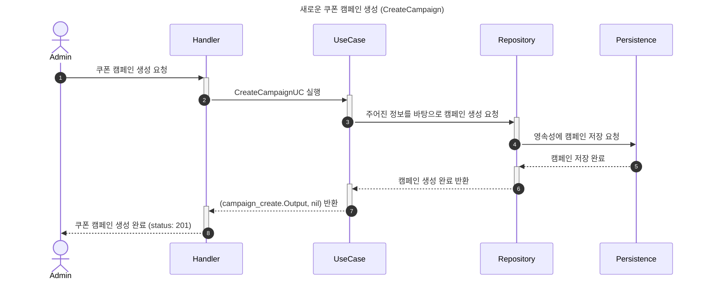
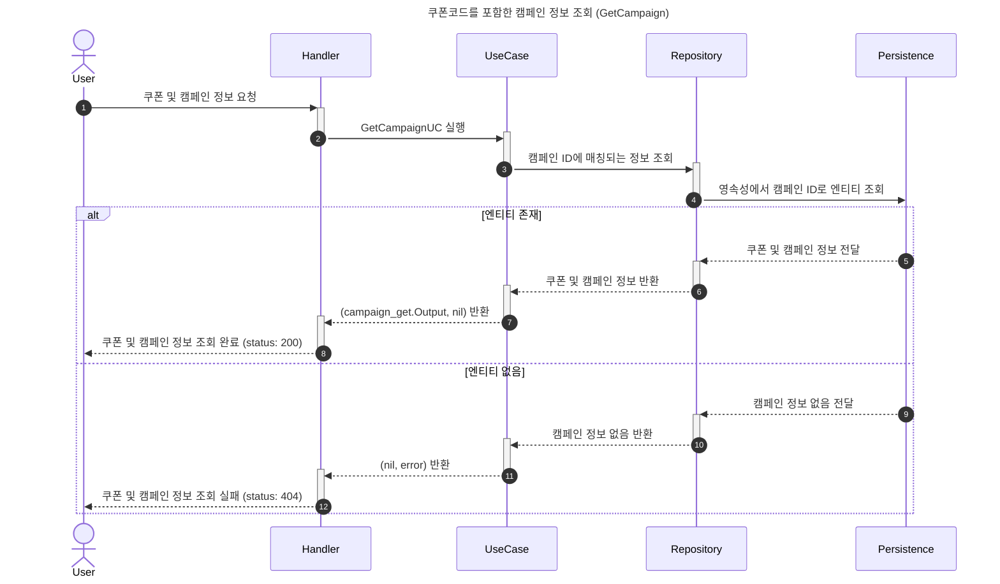

# 쿠폰 발행 시스템

## 1. 개요
* [과제 내용](./doc/PROBLEM.md)

## 2. 기술 선택
- **connectrpc**: 과제 기본 요구사항
- PostgreSQL: 캠페인/쿠폰 정보를 담는 영속성이자 분산환경에서 동시성처리의 핵심 기능 담당
- pgx: PostgreSQL 드라이버 확장

### 2.1 고려 사항

## 3. 아키텍처
클린 아키텍처 + DDD를 적용하고 있지만 의미없는 계층 구분에 추가적인 비용을 사용하지 않고 어디에서나 통용될 수 있는 아키텍처를 구성하는 것에 집중했습니다.
- 서로 분리된 레이어는 리포지토리를 통해 정보를 교환한다.
- 데이터 영속성 계층을 분리하는 경우 외에는 불필요한 인터페이스 추상화를 지양한다.
- 비즈니스 요구사항은 하나의 독립적인 기능이어야 한다. 비즈니스 로직의 변경이 의도치 않은 다른 유스케이스의 변동으로 전파되지 않도록 주의한다.
- DTO를 작성하는 것도 비용이기 때문에 유스케이스 구조체 내부에 Input/Output 구조체를 정의하고, Execute 메소드는 단일 Input을 매개변수로 받고 단일 Output을 반환한다.

### 3.1. 파일트리
기본적으로 클린 아키텍처를 기반으로 작성했으며, DDD에서 권장하는 컨벤션에 따라 아래와 같은 레이어를 가집니다.

- **domain**: 비즈니스 규칙과 데이터 모델과 연관된 엔티티, 값 객체, 열거형, 리포지토리, 도메인 서비스 등이 여기에 위치합니다.
- **application**: 비즈니스 로직을 담당하는 유스케이스가 여기에 위치합니다.
- **infra**: 서드파티 등 서비스와 느슨한 연결점을 가진 인프라스트럭처가 여기에 위치합니다.
- **interfaces**: 외부와 상호작용하는 엔드포인트가 여기에 위치합니다.

### 3.2. 시퀀스 다이어그램

### 3.3. ERD

## 4. 핵심 비즈니스 요구사항 이해하기

### 4.1. 이 과제는 어떤 시스템인가?
시작 부터 의문점이 생겼다. "쿠폰 발행은 지정된 일시에 자동으로 시작되어야 한다"는 문구는 단순 엔드포인트를 작성하는 것을 넘어 마치 프로덕션에 E2E 테스트케이스가 포함되어 있는 구조를 떠올리게 했다. 출고되자마자 갑자기 365일 24시간 공회전을 하기 시작하는 자동차를 상상해 봤다. 단지 엔드포인트 작성에 더해서 높은 부하를 일으키는 백그라운드 작업을 구성할 수 있는 능력을 시험하는 것이 출제 의도였을까? 우선 캠페인 생성이라는 엔드포인트가 요구사항이라는 점에 주목해 보기로 했다. 캠페인 생성 시에 시작일시를 정하고 생성할 텐데, 이 시작일시를 기준으로 스케줄러를 시작하면 될 것 같다. 따라서 cmd 레이어에는 컴파일을 위한 main.go 파일이 두 개가 되어야 한다. 마침 "예상 트래픽이 초당 500-1000개의 요청"이라는 전제가 포함되어 있으니 실제로 스케줄러를 준비한 뒤 초당 500-1000개의 RPC 요청이 시작되도록 구성하면 될 것 같다.

### 4.2. 데이터 저장은 어디에, 어떻게 하는가?
두번째로, 스케일 아웃에 의한 분산이 고려되어 있는 상황에서 쿠폰이 저장될 영속성이 필요하다는 것이다. 이를 보자마자 RDBMS를 사용하기로 했지만 분명 출제 내용에는 DB와 관련된 내용이 없다. 포지션에서는 PostgreSQL과 NoSQL을 활용한다고 했었는데, 그럼 NoSQL을 써야할까? 이 부분에 대해 고민해 봤지만 우선 기능이 단순하기 때문에 NoSQL은 현재 수준에서는 불필요한 기술이 될 가능성이 높다. 오히려 데이터 정합성을 해칠 가능성이 있기 때문에 배제. 따라서 RDBMS에 해당하는 가장 작은 단위인 SQLite를 쓰거나 기술스택에 존재하는 PostgreSQL를 사용하는 게 출제의도와 결이 맞을 텐데, 문제는 SQLite는 파일 단위로 관리되는 특성 때문에 스케일 아웃 환경에서 사용하기가 곤란한 데다가 동시성 제어에 필요한 락 기능도 빠져 있다. 결과적으로 PostgreSQL만 사용하는 것으로 결정했다.

그럼 ORM은 어떻게, 어떤 걸 사용할까? 우선 go에서 ORM을 사용하는 방식을 확인해 보니 어떤 ORM이든 DB에 연결하기 위한 드라이버가 필요하다. 이는 마치 Python에서 sqlalchemy라는 ORM과 psycopg2 드라이버를 함께 사용하는 구성와 결이 같았다. 하지만 본인은 주 언어스택이 Go가 아니고 Go의 문법 정도만 접한 상태인 데다가 제한시간은 사흘 뿐. 따라서 러닝커브를 강력하게 고려해야 한다. 가장 많이 쓰는 편이라고 알려진 gorm은 러닝커브를 문제로 여기서 제외, go의 표준 인터페이스인 database/sql 패키지가 평문 쿼리를 사용 가능하다는 점에서 먼저 고려됐고, 선택한 RDBMS가 PostgreSQL이라는 점에서 pgx를 살펴봤는데 상당히 괜찮아서 pgx를 사용하기로 했다. 왜냐하면 database/sql만 사용하는게 불편하다는 이유로 sqlx라는 패키지가 개발됐다는 내용으로 이해되는데, pgx는 sqlx에서 제공하는 수준의 확장을 지원하는 데다가 PostgreSQL 전용 드라이버도 포함돼있다고 한다. 이 시스템 한정으로는 위에서 이미 결정된 PostgreSQL이 다른 RDBMS로 변경될 가능성은 0에 수렴하니 pgx로 결정.

### 4.3. 동시성 제어는 어떻게 해야할까?
동시성 제어는 문제의 개요에도 적혀있는 핵심 비즈니스 요구사항에 해당한다. 주로 클라이언트에서 동시에 접근할 때에 데이터의 무결성이 주요 문제점이 될 것이고, 이걸 해결하기 위해서는 낙관적 락, 비관적 락, 분산 락이 고려되며, 아예 메시지브로커의 큐로 넘겨서 락을 걸지 않고 해결하는 방법도 있다는 것을 지식으로 알고 있다. 하지만 우선 낙관적 락의 경우에는 쿠폰의 발행이라는 행위 자체가 데이터 수정이 빈번하게 일어나는 케이스이기 때문에 고려에서 배제했고, 메시지브로커의 경우에도 무결성 보장에 더해 순서를 보장한다는 이점은 추가되겠지만 애초에 순서 보장은 이 과제에서 말하는 비즈니스 요구사항이 아니고, 작업이 완료된 이후에 클라이언트에게 쿠폰이 발행되었는지 여부를 알려야 하는 문제가 있는 등 오버엔지니어링이 될 가능성이 높다. 그러면 비관적 락과 분산 락만 남는데, 분산 락을 사용하게 된다면 Redis나 Valkey 사용이 강제되고 이러한 인프라스트럭처를 추가하기엔 이 시스템은 분산락 외에 용도가 없다고 봐도 무방하다. 게다가 프로그램이 강제종료 됐을 때 분산락이 데드락이 되는 부분도 해결할 필요가 있다. 초당 500-1000회의 요청, 특히 과제 특성상 인트라넷에서 작동할 텐데 이러한 트레이드 오프를 감당할 정도는 아니라고 판단했고, 다른 인프라스트럭처를 추가할 필요 없이 PostgreSQL은 이미 비관적 락을 포함하고 있기 때문에 비관적 락을 활용해서 동시성 제어 문제를 해결하기로 했다.

## 5. 실행 및 테스트 방법

### 5.1. 시스템 실행

### 5.2. 부하 테스트 실행

## 6. 테스트 결과 및 결론

## 7. 향후 개선 과제
